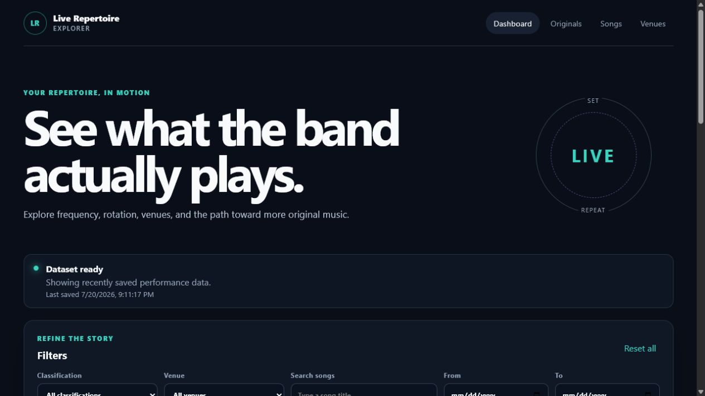
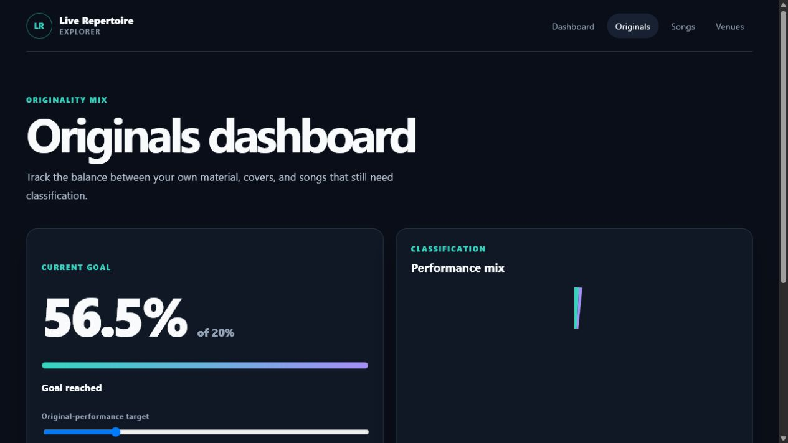
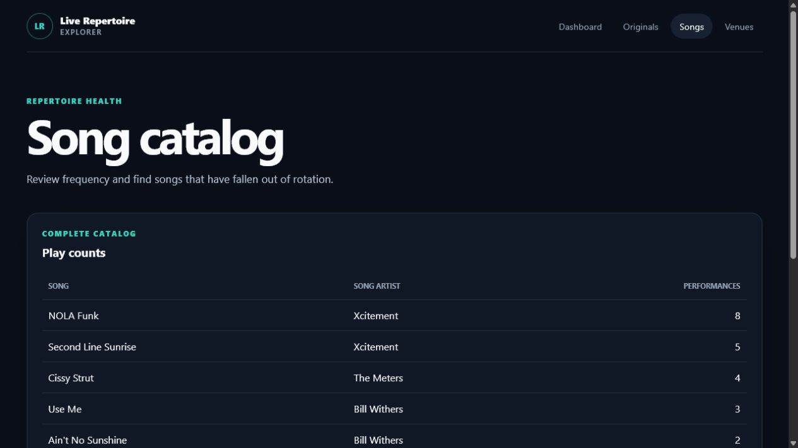

# Live Repertoire Explorer

A local-first React single-page application for exploring concert setlist trends,
song frequency, repertoire concentration, venues, and original-music goals.

## Screenshots

### Dashboard overview

The main dashboard combines live dataset status, filters, summary metrics, and
performance charts. Filters recalculate the visible analytics immediately.



### Original-music goal

The originals view compares originals, covers, and unknown classifications and
shows progress toward an adjustable original-performance target.



### Repertoire health

The song catalog ranks material by play count and identifies songs that have
fallen outside the recent rotation.



## Run the project

```powershell
npm install
npm run dev
```

Create a production build with `npm run build` and preview it with
`npm run preview`.

## Tests and architecture

Run the automated unit and service tests once with `npm test`, or keep them
running while you edit with `npm run test:watch`.

The class responsibilities, state flow, data-loading sequence, design choices,
and extension points are documented in
[the architecture document](docs/ARCHITECTURE.md).

## Data source

The default public GET loads `public/data/performances.json` at the browser URL
`data/performances.json`. Set
`VITE_DATASET_URL` in a local `.env` file to use a published JSON or CSV URL.
Every source must normalize to the fields demonstrated in the sample file.

Startup follows a stale-while-revalidate policy: cached data renders first,
then a successful network response replaces the complete cache. The cache has a
schema version and remains available if the request fails.

## Optional JSONBin write

Copy `.env.example` to `.env`, then supply a JSONBin bin ID and access key. The
app writes only a goal percentage, filter preset, and timestamp. Its merge policy
is last-write-wins using `updatedAt`.

Client-side environment values are visible in a browser bundle. Use only a
restricted demonstration key and never put private or sensitive data in the bin.

## GitHub Pages

The Vite build uses relative assets and hash-based routing, so the contents of
`dist/` can be published from a repository subpath without server rewrites.
