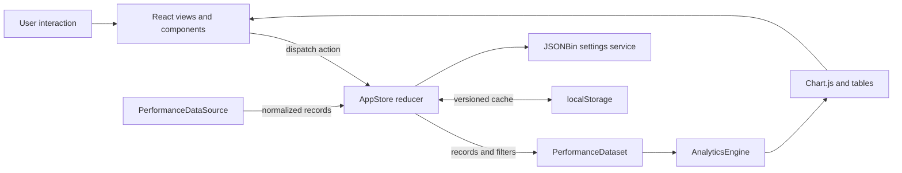
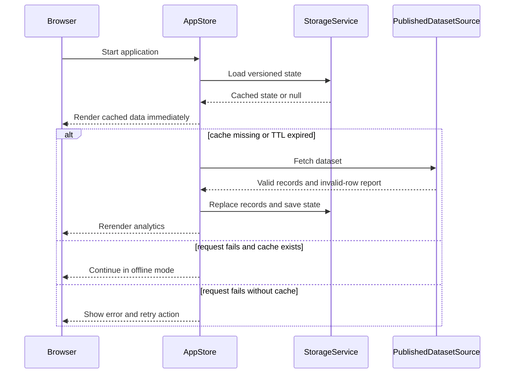

# Live Repertoire Explorer: Design and Architecture

## 1. Purpose

Live Repertoire Explorer is a thick-client, local-first analytics single-page
application. It loads concert performance records, normalizes them into one
internal schema, calculates repertoire statistics in the browser, and renders
interactive React views and Chart.js charts.

The temporary sample dataset and future Xcitement dataset share the same output
contract. This is the central design decision: analytics and UI code depend on
normalized `PerformanceRecord` objects, not on a particular API, spreadsheet,
or source-specific column layout.

## 2. Architectural style

The project combines four patterns:

1. **Layered architecture** separates UI, state, domain logic, and external I/O.
2. **Repository/data-source abstraction** hides how performance data is loaded.
3. **Local-first stale-while-revalidate flow** displays saved data before using
   the network.
4. **Unidirectional state flow** sends user actions through a reducer, derives
   analytics from current state, and rerenders React components.



## 3. Directory responsibilities

| Directory | Responsibility |
| --- | --- |
| `src/app` | Application shell, navigation, and route definitions |
| `src/models` | Domain objects and record collection operations |
| `src/analytics` | Pure analytics calculations |
| `src/services` | Dataset, browser storage, and cloud I/O |
| `src/state` | Central application state and transitions |
| `src/views` | Route-level screens |
| `src/components` | Reusable UI controls and displays |
| `src/charts` | Shared Chart.js registration and options |
| `src/utils` | CSV parsing and file export helpers |
| `src/config` | Environment-derived settings and defaults |
| `public/data` | Replaceable demonstration dataset |
| `tests` | Automated unit and service tests |

## 4. Domain schema

One record represents one song performed at one concert:

```json
{
  "performanceId": "2026-07-12-3090-nola-funk",
  "gigId": "2026-07-12-3090",
  "gigDate": "2026-07-12",
  "venue": "30/90",
  "city": "New Orleans",
  "songTitle": "NOLA Funk",
  "songArtist": "Xcitement",
  "performingArtist": "Xcitement",
  "classification": "original",
  "setNumber": 2,
  "position": 5
}
```

`classification` is always `original`, `cover`, or `unknown`. Missing or
unrecognized values become `unknown`; they are never guessed.

## 5. Classes

### `PerformanceRecord`

File: `src/models/PerformanceRecord.js`

Represents one normalized performance. Its constructor cleans repeated
whitespace, validates real ISO calendar dates, converts numeric set positions,
normalizes classification, and rejects records missing required identity,
concert, date, venue, song, or performer fields.

Important methods:

- `validate()` returns validation messages for required fields.
- `toJSON()` returns a serializable plain representation.
- `PerformanceRecord.from(input)` is the standard construction entry point.

### `PerformanceDataset`

File: `src/models/PerformanceDataset.js`

Owns a collection of normalized records. It provides domain-level collection
operations without knowing anything about React.

Important methods:

- `filter(filters)` returns a new dataset filtered by classification, venue,
  partial song title, and inclusive date range.
- `sortByDate(direction)` returns a sorted array without mutating the dataset.
- `unique(field)` returns sorted distinct values for filter controls.

### `AnalyticsEngine`

File: `src/analytics/AnalyticsEngine.js`

Performs deterministic calculations over a supplied record array. It has no
network, storage, or UI dependencies, which makes it the easiest layer to test.

Important methods:

- `summary()` calculates unique concerts, performances, and songs.
- `songPlayCounts()` ranks songs by frequency.
- `classificationBreakdown()` calculates counts and percentages.
- `performancesByMonth()` builds time-series data.
- `venueCounts()` compares performance activity by venue.
- `repertoireConcentration(limit)` measures the percentage of performances
  represented by the most-played songs.
- `staleSongs(days)` finds songs absent from the recent rotation relative to
  the newest date in the dataset.
- `originalsGoalProgress(goal)` compares the original-song rate with a target.

### `ChartRenderer`

File: `src/charts/ChartRenderer.js`

Registers the Chart.js components used by the application and supplies shared
responsive options. React chart components remain responsible for mounting and
updating actual chart instances.

### `PerformanceDataSource`

File: `src/services/PerformanceDataSource.js`

Abstract base class defining the `loadPerformances()` contract. Calling the
base implementation throws, ensuring subclasses provide their own loader.

### `PublishedDatasetSource`

File: `src/services/PublishedDatasetSource.js`

Loads JSON or CSV with `fetch` and `async/await`. It uses `AbortController`, a
request timeout, and exponential retry delays. Each input row is converted to a
`PerformanceRecord`; invalid rows are reported separately rather than silently
entering the dataset.

### `XcitementSheetSource`

File: `src/services/PublishedDatasetSource.js`

Currently inherits published-dataset behavior because a published Xcitement
sheet can expose CSV with the normalized column names. If the eventual sheet
uses different headings, this subclass is where those headings should be
mapped before constructing `PerformanceRecord` objects.

### `StorageService`

File: `src/services/StorageService.js`

Encapsulates versioned `localStorage` reads and writes. Invalid JSON or a schema
version mismatch returns `null`. `isFresh()` applies the configured cache TTL.

The current replacement policy is **complete replacement**: when a valid newer
source response arrives, it replaces the cached record array. Local filters,
settings, and saved views remain part of the saved application state.

### `CloudSettingsService`

File: `src/services/CloudSettingsService.js`

Reads and writes the small JSONBin settings artifact. It checks `updatedAt` and
uses last-write-wins when local and remote values differ. It does not send the
performance dataset or authentication/user data to JSONBin.

### Dashboard coordination

The original project outline suggested a `DashboardController` class. In this
React implementation, that role is intentionally split between:

- `AppStoreProvider`, which coordinates loading, persistence, state transitions,
  and derived filtered records;
- the reducer in `AppStore.jsx`, which defines state transitions; and
- route views, which invoke `AnalyticsEngine` and translate results into chart
  and table props.

This is the React equivalent of a controller and avoids maintaining a second
imperative state system beside React.

## 6. State model

The central state contains:

| Field | Meaning |
| --- | --- |
| `records` | Complete normalized performance collection |
| `filters` | Classification, venue, search, and date selections |
| `settings` | Original-song percentage target |
| `savedViews` | Named local filter/goal presets |
| `status` | `loading`, `refreshing`, `success`, `empty`, `offline`, or `error` |
| `message` | Human-readable load status |
| `lastUpdated` | Cache timestamp |
| `invalidCount` | Rejected source row count |



## 7. View architecture

- `DashboardView` contains shared filters, summary metrics, top-song and monthly
  charts, the frequency table, data tools, and saved views.
- `OriginalsView` shows classification mix and original-performance goal status.
- `SongsView` shows complete song counts and songs outside the 90-day rotation.
- `VenuesView` compares the number of song performances at each venue.
- `App.jsx` owns the responsive shell and `HashRouter` route mapping.

Hash routing and Vite's relative asset base allow GitHub Pages deployment under
a repository subdirectory without server-side rewrite rules.

## 8. Security and configuration

`VITE_DATASET_URL`, `VITE_JSONBIN_BIN_ID`, and `VITE_JSONBIN_ACCESS_KEY` are
read from `.env`; `.env` is ignored by Git. Vite values are still visible in a
compiled browser bundle, so the JSONBin credential must be a restricted course
demonstration key. Sensitive or private data must never be stored in the bin.

## 9. Testing strategy

Vitest was selected because it runs Vite-compatible ES modules directly and
requires little configuration. The initial suite covers:

- record normalization and rejection of invalid data;
- dataset filters and non-mutating sorting;
- analytics counts, percentages, concentration, trends, and stale songs;
- storage versioning, corrupt data behavior, and TTL decisions;
- CSV parsing;
- public-source success, invalid-row reporting, and failed requests.

Run once with `npm test`. Use `npm run test:watch` while editing. The test suite
does not contact the real network; service tests replace `fetch` with controlled
responses.

## 10. Extension points

The next safe extensions are:

1. Override normalization in `XcitementSheetSource` after the real sheet column
   names are known.
2. Add schema migration functions before increasing the storage schema version.
3. Add React Testing Library only when component interaction tests become a
   course requirement.
4. Add end-to-end browser tests after deployment details are stable.
